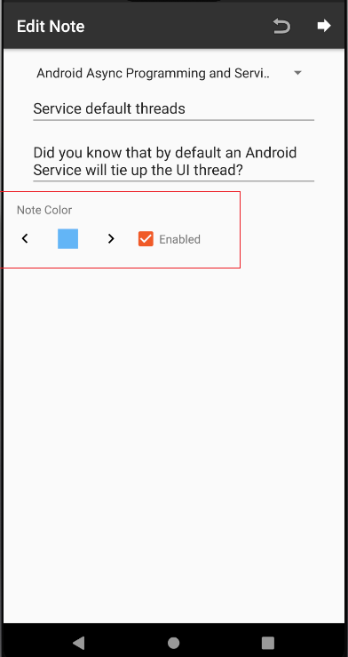

## Android Apps with Kotlin: Custom Views - PluralSight course

 - create a ColorSelector custom view by combining views into a compound component
 - communication between view and activity
 - add custom attributes

## Screenshots

   